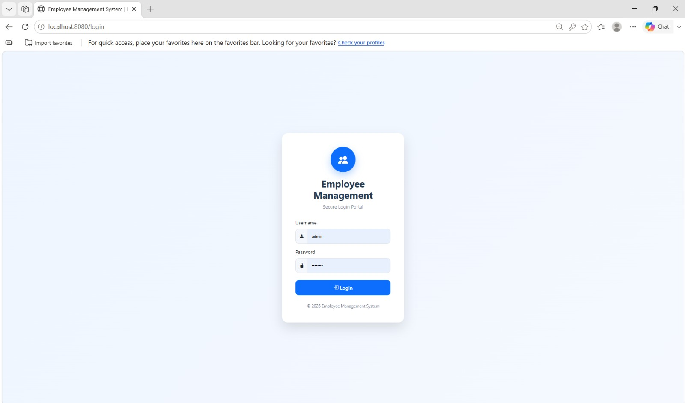
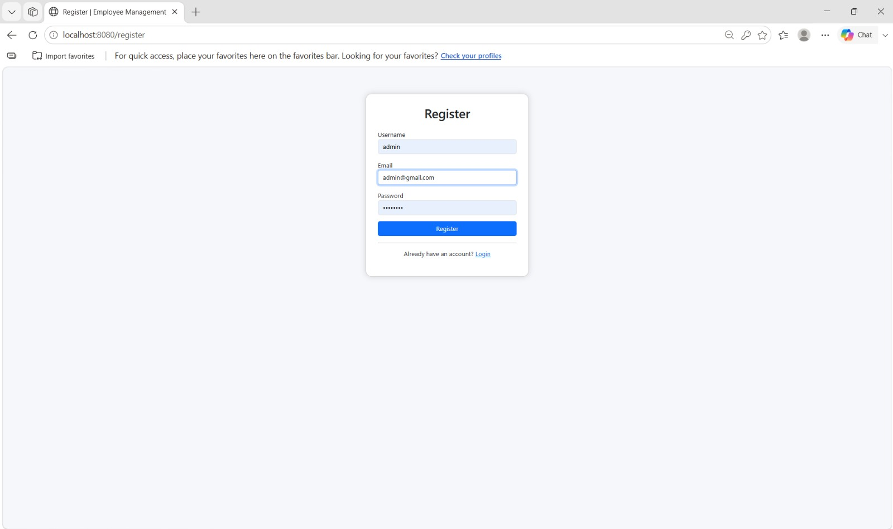
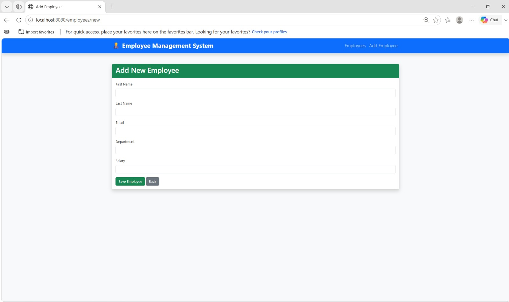
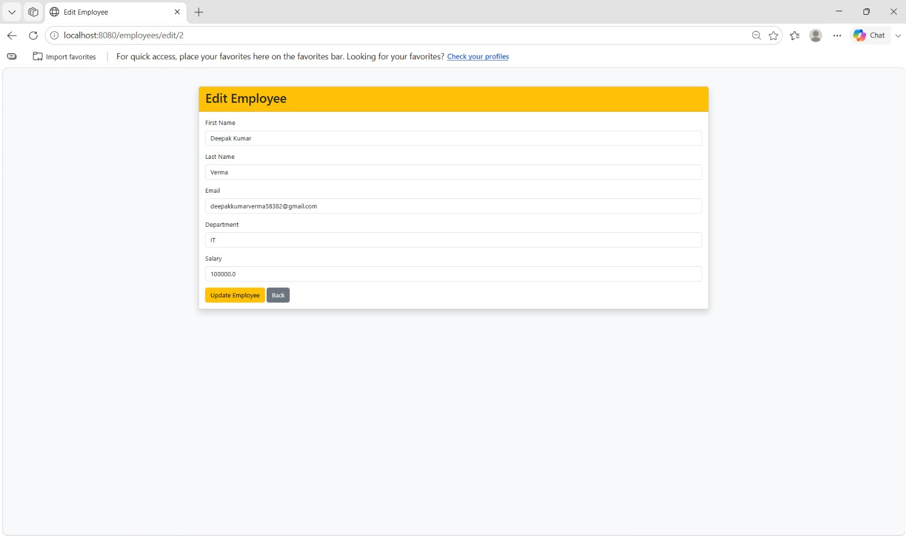
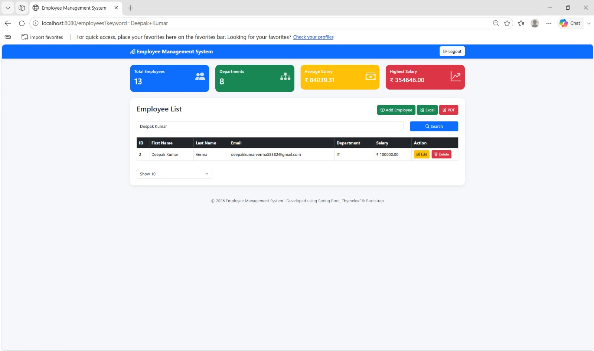
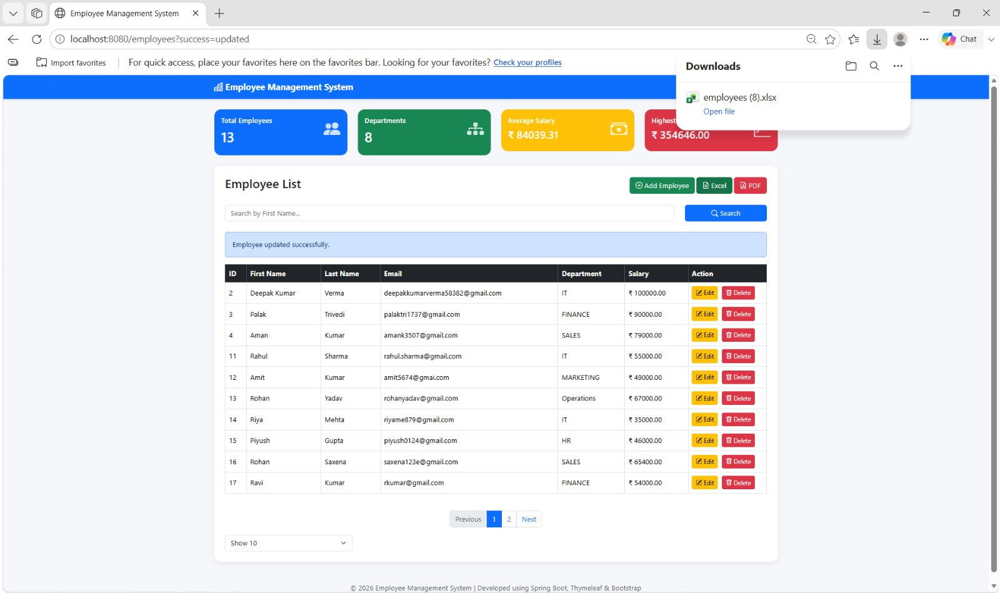

# Employee Management System

A full-stack web-based Employee Management System developed using Java and Spring Boot. The application provides secure authentication, 
role-based authorization, employee CRUD operations, search, pagination, and employee data export to Excel and PDF.

---

## 🔗 Project Links

- **GitHub Repository:** https://github.com/CodeWithDeepak-Tech/employee-management-system

## 📌 Project Overview

The Employee Management System is designed to simplify the management of employee records in an organization.

The application allows authorized users to add, view, update, delete, and search employee information. 
It also provides authentication and role-based access control using Spring Security.

Employee data is stored in a MySQL database and accessed using Spring Data JPA and Hibernate.

The application follows the MVC architecture to maintain a clean separation between the presentation, business logic, and database layers.

---

## 🚀 Features

### 🔐 Authentication & Authorization

- User registration
- Secure login and logout
- Password encryption using BCrypt
- Spring Security authentication
- Role-based authorization
- Protected application routes

### 👨‍💼 Employee Management

- Add new employees
- View employee records
- Update employee information
- Delete employees
- Search employees
- Paginated employee listing

### 📊 Data Export

- Export employee records to Excel
- Export employee records to PDF
- Generate downloadable employee reports

### 🎨 User Interface

- Responsive web interface
- Bootstrap-based design
- Thymeleaf server-side templates
- User-friendly forms
- Navigation between application modules

---

## 🛠️ Technology Stack

### Backend

- Java 17
- Spring Boot
- Spring MVC
- Spring Security
- Spring Data JPA
- Hibernate

### Frontend

- HTML5
- CSS3
- JavaScript
- Thymeleaf
- Bootstrap

### Database

- MySQL

### Libraries

- Apache POI
- iText PDF
- Lombok

### Build & Version Control

- Maven
- Git
- GitHub

---

## 🏗️ Architecture

The application follows the **Model-View-Controller (MVC)** architecture.

```text
                    Employee Management System
                              |
                    ---------------------
                    |                   |
                 Frontend            Backend
                    |                   |
             Thymeleaf +          Spring Boot
              Bootstrap                |
                                      |
                              ----------------
                              |      |       |
                         Controller Service Repository
                              |      |       |
                              --------|-------
                                     |
                                  MySQL
```

### Application Flow

```text
User
  ↓
Thymeleaf / Bootstrap UI
  ↓
Controller
  ↓
Service Layer
  ↓
Repository Layer
  ↓
MySQL Database
```

---

## 📂 Project Structure

```text
employee-management-system
│
├── src
│   ├── main
│   │   ├── java/com/ems
│   │   │   ├── config
│   │   │   │   └── SecurityConfig.java
│   │   │   │
│   │   │   ├── controller
│   │   │   │   ├── EmployeeController.java
│   │   │   │   ├── HomeController.java
│   │   │   │   ├── LoginController.java
│   │   │   │   └── RegisterController.java
│   │   │   │
│   │   │   ├── dto
│   │   │   │
│   │   │   ├── entity
│   │   │   │   ├── Employee.java
│   │   │   │   └── User.java
│   │   │   │
│   │   │   ├── exception
│   │   │   │
│   │   │   ├── export
│   │   │   │   ├── EmployeeExcelExporter.java
│   │   │   │   └── EmployeePdfExporter.java
│   │   │   │
│   │   │   ├── repository
│   │   │   │   ├── EmployeeRepository.java
│   │   │   │   └── UserRepository.java
│   │   │   │
│   │   │   ├── security
│   │   │   │   └── CustomUserDetailsService.java
│   │   │   │
│   │   │   └── service
│   │   │       ├── EmployeeService.java
│   │   │       ├── EmployeeServiceImpl.java
│   │   │       ├── UserService.java
│   │   │       └── UserServiceImpl.java
│   │   │
│   │   └── resources
│   │       ├── static
│   │       │
│   │       ├── templates
│   │       │   ├── fragments
│   │       │   ├── create_employee.html
│   │       │   ├── edit_employee.html
│   │       │   ├── employees.html
│   │       │   ├── home.html
│   │       │   ├── login.html
│   │       │   └── register.html
│   │       │
│   │       └── application.properties
│
├── screenshots
│   ├── login.png
│   ├── register.png
│   ├── dashboard.png
│   ├── add-employee.png
│   ├── edit-employee.png
│   ├── search.png
│   └── export.png
│
├── .gitignore
├── pom.xml
└── README.md
```

---
### 1. 🔐 Login Page



---

### 2. 📝 Registration Page



---

### 3. 👨‍💼 Employee Dashboard


---

### 4. ➕ Add Employee



---

### 5. ✏️ Edit Employee



---

### 6. 🔍 Search Employee



---

### 7. 📊 Excel & PDF Export




## 🔑 Security

Spring Security is used to secure the application.

### Security Features

- Authentication using username and password
- BCrypt password encryption
- Role-based authorization
- Protected application endpoints
- Login and logout functionality

Example roles:

```text
ADMIN
USER
```

The role of a user determines which operations they are authorized to perform.

---

## 🗄️ Database

The application uses **MySQL** for persistent data storage.

### Main Tables

```text
users
employees
```

The `users` table stores authentication-related information such as:

- Username
- Email
- Encrypted password
- Role
- Enabled status

Employee information is stored separately and accessed through the repository layer.

---

## 🔄 CRUD Operations

The application provides complete employee CRUD functionality.

### Create

Add a new employee through the employee registration form.

### Read

Display employee records in a paginated employee list.

### Update

Modify existing employee information.

### Delete

Remove an employee record from the database.

---

## 🔍 Search & Pagination

The employee management module includes:

- Employee search
- Paginated results
- Easy navigation through employee records

Pagination helps manage employee records efficiently.

---

## 📊 Excel Export

The application provides Excel export functionality using **Apache POI**.

Employee information can be exported into an Excel file for:

- Reporting
- Data analysis
- Record keeping
- Offline usage

---

## 📄 PDF Export

The application also supports PDF report generation using **iText PDF**.

Employee records can be converted into a downloadable PDF document.

---

## ⚙️ Configuration

Update the database configuration in:

```text
src/main/resources/application.properties
```

Example:

```properties
spring.datasource.url=jdbc:mysql://localhost:3306/employee_management
spring.datasource.username=YOUR_USERNAME
spring.datasource.password=YOUR_PASSWORD

spring.jpa.hibernate.ddl-auto=update
spring.jpa.show-sql=true
```

Replace the username and password with your local MySQL credentials.

> **Important:** Never upload real database passwords or other sensitive credentials to GitHub.

---

## ▶️ How to Run

### 1. Clone the Repository

```bash
git clone https://github.com/CodeWithDeepak-Tech/employee-management-system.git
```

### 2. Open the Project

Open the project using:

- IntelliJ IDEA
- Eclipse
- VS Code

### 3. Configure MySQL

Create the required MySQL database and update:

```text
application.properties
```

with your local database credentials.

### 4. Build the Project

```bash
mvn clean install
```

### 5. Run the Application

```bash
mvn spring-boot:run
```

### 6. Open in Browser

```text
http://localhost:8080/login
```

---


---

## 📈 Future Enhancements

- Employee profile images
- Advanced employee filtering
- Department management
- Email notifications
- Attendance management
- Leave management
- REST API integration
- Dashboard analytics
- Cloud deployment
- Docker support

---

## 🎯 Learning Outcomes

Through this project, I gained practical experience in:

- Core Java and Object-Oriented Programming
- Spring Boot
- Spring MVC
- Spring Security
- Authentication and authorization
- MySQL database integration
- Spring Data JPA
- Hibernate
- CRUD operations
- MVC architecture
- HTML5, CSS3 and JavaScript
- Thymeleaf
- Bootstrap
- Excel report generation
- PDF report generation
- Maven
- Git and GitHub
- Debugging and application development

---

## 👨‍💻 Author

**CodeWithDeepak-Tech**

GitHub:

https://github.com/CodeWithDeepak-Tech

---

## 📄 License

This project is developed for educational and portfolio purposes.
